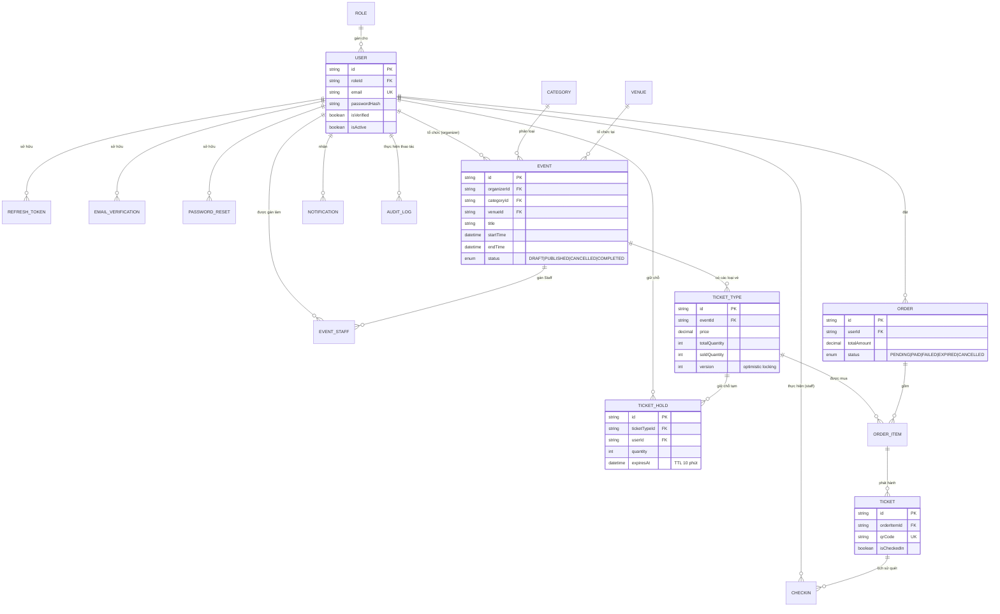

# EventHub — Nền tảng Đặt vé & Quản lý Sự kiện

Backend API cho nền tảng đặt vé sự kiện (kiểu Ticketbox/Eventbrite thu nhỏ), xây dựng để luyện tập và chứng minh năng lực xử lý các bài toán backend thật: **race condition khi nhiều người tranh mua vé cuối cùng, RBAC + Resource-based Authorization, xử lý bất đồng bộ (message queue), caching, realtime, và vận hành hạ tầng (Docker/CI-CD/Monitoring)**.

> Dự án không phải 1 CRUD app thông thường — mỗi quyết định kỹ thuật đều xuất phát từ 1 bài toán nghiệp vụ có thật, được ghi chú ngay trong code.
> Link Demo: https://eventhub-1lf8.onrender.com

---

## Mục lục

- [Kiến trúc tổng quan](#kiến-trúc-tổng-quan)
- [Sơ đồ dữ liệu (ERD)](#sơ-đồ-dữ-liệu-erd)
- [Tech Stack](#tech-stack)
- [Tính năng chính](#tính-năng-chính)
- [Cài đặt & Chạy thử](#cài-đặt--chạy-thử)
- [Biến môi trường](#biến-môi-trường)
- [Testing](#testing)
- [CI/CD](#cicd)
- [Monitoring](#monitoring)
- [Giới hạn đã biết](#giới-hạn-đã-biết)
- [Tài liệu API](#tài-liệu-api)

---

## Kiến trúc tổng quan

```
Client (Postman / socket-demo.html)
        │
        ▼
┌──────────────────────────────────────────┐
│  Express App (Node.js + TypeScript)      │
│  ├── Middleware: Helmet, CORS, Rate Limit│
│  ├── Auth (JWT access/refresh + rotation)│
│  ├── RBAC + Resource-based Authorization │
│  └── Socket.IO (realtime dashboard)      │
└───────┬───────────┬──────────┬───────────┘
        │           │          │
        ▼           ▼          ▼
   PostgreSQL     Redis     RabbitMQ
   (Neon)       (Upstash)  (CloudAMQP)
   - dữ liệu     - cache     - queue gửi
     nghiệp vụ     Cache-      email bất
     qua Prisma    Aside       đồng bộ
                              (Consumer
                               riêng)
        │
        ▼
   Cloudinary (ảnh bìa sự kiện)
```

**Nguyên tắc kiến trúc:**
- **Clean Architecture theo module** (feature-based, không phải layer-based): mỗi module (`auth`, `event`, `order`...) tự chứa đủ `validation → repository → service → controller → route`
- **Repository Pattern**: chỉ Repository được chạm Prisma trực tiếp — Service không bao giờ import `prisma`, giúp mock dễ dàng khi viết Unit Test
- **Toàn bộ dịch vụ hạ tầng dùng managed cloud service** (Neon/Upstash/CloudAMQP/Cloudinary) thay vì tự host qua Docker Compose — phù hợp với quy mô cá nhân, tránh chi phí VPS, vẫn giữ nguyên tư duy kiến trúc như khi tự host thật

---

## Sơ đồ dữ liệu (ERD)



**17 bảng nghiệp vụ**, chia 4 nhóm: Auth & User, Event, Ticket (giao dịch), Vận hành (Notification/AuditLog). Chi tiết thiết kế và lý do (VD "vì sao tách `TicketHold` khỏi `Order`") xem trực tiếp trong `prisma/schema.prisma` — mọi quyết định thiết kế đều có comment giải thích.

---

## Tech Stack

| Nhóm | Công nghệ | Vai trò |
|---|---|---|
| Runtime | Node.js, TypeScript, Express 5 | API server |
| Database | PostgreSQL (Neon) + Prisma ORM | Lưu trữ dữ liệu nghiệp vụ |
| Cache | Redis (Upstash) + ioredis | Cache-Aside Pattern cho API đọc nhiều |
| Message Queue | RabbitMQ (CloudAMQP) + amqplib | Gửi email bất đồng bộ |
| Realtime | Socket.IO | Dashboard bán vé live cho Organizer |
| Object Storage | Cloudinary | Lưu ảnh bìa sự kiện |
| Validation | Zod | Validate request, tự sinh TypeScript type |
| Auth | JWT (access + refresh token rotation) | Xác thực + RBAC |
| Testing | Jest, Supertest, ts-jest | Unit test (mock Repository) + Integration test (middleware) |
| Containerization | Docker, Docker Compose (multi-stage build) | Đóng gói & triển khai |
| CI/CD | GitHub Actions | Tự động test + deploy lên Render |
| Monitoring | Prometheus + Grafana | Metrics: latency, tổng vé bán, tỷ lệ giữ chỗ thất bại |
| Email | Nodemailer (Gmail SMTP) + qrcode | Gửi vé kèm ảnh QR thật |
| Excel | ExcelJS | Export doanh thu / Import vé mời hàng loạt |

---

## Tính năng chính

### Authentication & Authorization
- Đăng ký/đăng nhập, JWT access token (15p) + refresh token (7 ngày, lưu hash, hỗ trợ **token rotation**)
- Xác thực email, quên/đặt lại mật khẩu (đổi mật khẩu tự động **thu hồi mọi session cũ**)
- **RBAC 4 role**: Admin / Organizer / Staff / Customer
- **Resource-based Authorization**: Organizer chỉ sửa được Event của chính mình (không chỉ dựa vào role)

### Race Condition (phần "đinh" của dự án)
- Cơ chế **giữ chỗ vé (TicketHold)** dùng **Optimistic Locking** (cột `version`, thuật toán CAS + retry) — đã load-test bằng `autocannon`, xác nhận **không bao giờ oversell** dù nhiều request tranh chấp đồng thời
- Job dọn tự động hold hết hạn, transaction atomic khi checkout

### Vận hành sự kiện
- CRUD Event/TicketType/Category/Venue với đầy đủ ràng buộc nghiệp vụ (không xóa khi đã có giao dịch, không sửa được Event đã hủy/kết thúc...)
- Gán Staff vào Event, Check-in vé qua QR code (3 tầng phân quyền: Admin bypass / Organizer sở hữu / Staff được gán)
- Export báo cáo doanh thu ra Excel, Import vé mời hàng loạt từ Excel

### Hạ tầng & Vận hành
- Cache-Aside Pattern (Redis) cho API đọc nhiều
- Gửi email bất đồng bộ qua RabbitMQ (không chặn response API)
- Upload ảnh qua Cloudinary
- Dashboard realtime (Socket.IO) báo Organizer khi có vé mới bán
- Full-Text Search (PostgreSQL `tsvector`/`ts_rank`, xếp hạng theo độ liên quan)
- Audit Log ghi vết mọi thao tác nhạy cảm (đổi role, sửa/xóa Event...)
- Rate Limiting chống brute-force
- Containerized bằng Docker (multi-stage build), CI/CD tự động qua GitHub Actions, Monitoring qua Prometheus/Grafana

---

## Cài đặt & Chạy thử

### Yêu cầu
- Node.js ≥ 20
- Docker Desktop (nếu chạy qua container)
- Tài khoản: [Neon](https://neon.tech) (Postgres), [Upstash](https://upstash.com) (Redis), [CloudAMQP](https://www.cloudamqp.com) (RabbitMQ), [Cloudinary](https://cloudinary.com) — đều có free tier không cần thẻ

### Chạy local (dev)
```bash
git clone https://github.com/hdthinh3105-hub/EventHub.git
cd eventhub-backend
npm install
cp .env.example .env   # điền đầy đủ giá trị thật (xem bảng biến môi trường bên dưới)
npx prisma generate
npx prisma migrate dev
npx prisma db seed      # tạo 4 role + user demo (mật khẩu: Password123!)
npm run dev
```
Server chạy tại `http://localhost:4000`. Kiểm tra: `GET /health`.

### Chạy qua Docker
```bash
docker compose build
docker compose up -d
```
Kèm theo Prometheus (`:9090`) và Grafana (`:3001`, tài khoản `admin`/`admin`) chạy cùng lúc để giám sát local.

### Tài liệu test API đầy đủ
Xem [`docs/API_TESTING_GUIDE.md`](./docs/API_TESTING_GUIDE.md) — body JSON mẫu + ràng buộc nghiệp vụ cho toàn bộ endpoint, kèm luồng test End-to-End 12 bước.

---

## Biến môi trường

| Biến | Mô tả |
|---|---|
| `DATABASE_URL` | Connection string PostgreSQL (Neon) |
| `JWT_ACCESS_SECRET` / `JWT_REFRESH_SECRET` | Secret ký JWT, tối thiểu 32 ký tự, **khác nhau** |
| `REDIS_URL` | Connection string Redis (Upstash, dạng `rediss://`) |
| `RABBITMQ_URL` | Connection string RabbitMQ (CloudAMQP) |
| `GMAIL_USER` / `GMAIL_APP_PASSWORD` | Tài khoản Gmail dùng gửi email (App Password, không phải mật khẩu thật) |
| `CLOUDINARY_CLOUD_NAME` / `CLOUDINARY_API_KEY` / `CLOUDINARY_API_SECRET` | Thông tin Cloudinary |
| `FRONTEND_URL` | URL Frontend (dùng tạo link trong email; project chưa có FE nên chỉ để placeholder) |
| `ALLOWED_ORIGINS` | Danh sách domain được phép gọi API (CORS), phân cách dấu phẩy |

Xem đầy đủ ràng buộc validate tại `src/config/env.ts` (dùng Zod, fail-fast nếu thiếu biến).

---

## Testing

```bash
npm test
```

**Chiến lược test** (không chạy theo % coverage, mà ưu tiên đúng chỗ khó nhất):
- **Unit test** (`tests/unit`): mock hoàn toàn Repository, kiểm chứng chính xác thuật toán Optimistic Locking (Phase 7) — ép được server rơi vào đúng kịch bản race condition mong muốn (CAS thất bại rồi thắng, thất bại liên tục hết retry...), điều rất khó lặp lại chính xác khi chạy load-test thật
- **Integration test** (`tests/integration`): dùng `supertest` gọi thẳng vào `app` (không mở port), kiểm chứng đúng hành vi middleware chain (401/400/404) mà không cần DB/Redis/RabbitMQ thật

---

## CI/CD

Mỗi lần `push`/tạo Pull Request vào `main`, GitHub Actions tự động: cài đặt → generate Prisma Client → `tsc --noEmit` → `npm test` → build production. Nếu **push thẳng vào `main`** và mọi bước trên pass, tự động gọi Deploy Hook để triển khai lên Render.

Xem `.github/workflows/ci.yml`.

---

## Monitoring

Endpoint `GET /metrics` (format Prometheus) expose:
- `http_request_duration_seconds` — độ trễ từng request, theo route/method/status code
- `eventhub_tickets_sold_total` — tổng số vé đã bán (bao gồm cả vé mời)
- `eventhub_hold_rejected_total{reason}` — số lần giữ chỗ bị từ chối, phân biệt **hết vé thật** (`out_of_stock`) và **tranh chấp kỹ thuật** (`contention`) — 2 con số này đòi hỏi 2 hướng xử lý khác nhau nếu tăng bất thường

---

## Giới hạn đã biết

Trung thực về phạm vi — đây không phải hệ thống production hoàn chỉnh, mà là project luyện tập tập trung vào chiều sâu kỹ thuật:

- **Render Free tier có cold start** (~30-60s sau 15 phút không có request) — chấp nhận được cho mục đích demo, không ảnh hưởng tính đúng đắn dữ liệu (đã thiết kế các cơ chế phòng thủ: hold hết hạn tự loại trừ khỏi tính toán dù job dọn dẹp có tạm dừng, RabbitMQ queue `durable` không mất message khi consumer tạm ngừng)
- **Chưa có Frontend** — mọi luồng UX (link email, redirect sau thanh toán...) được thiết kế đúng chuẩn nhưng test qua Postman/`socket-demo.html`
- **Test coverage tập trung vào logic quan trọng nhất** (race condition, middleware chain), chưa phủ hết mọi Service/Controller
- **Chưa tích hợp**: Google Login, Swagger/OpenAPI docs — không nằm trong phạm vi cốt lõi, có thể mở rộng sau
- **Full-Text Search dùng PostgreSQL native** thay vì Elasticsearch — quyết định có chủ đích (xem giải thích trong `event.repository.ts`), phù hợp quy mô dữ liệu vừa/nhỏ

---

## Tài liệu API

- [`docs/API_TESTING_GUIDE.md`](./docs/API_TESTING_GUIDE.md) — toàn bộ endpoint, body JSON mẫu, ràng buộc nghiệp vụ
- [`docs/INTERVIEW_PREP.md`](./docs/INTERVIEW_PREP.md) — tổng hợp câu hỏi/trả lời phỏng vấn theo từng chủ đề kỹ thuật
